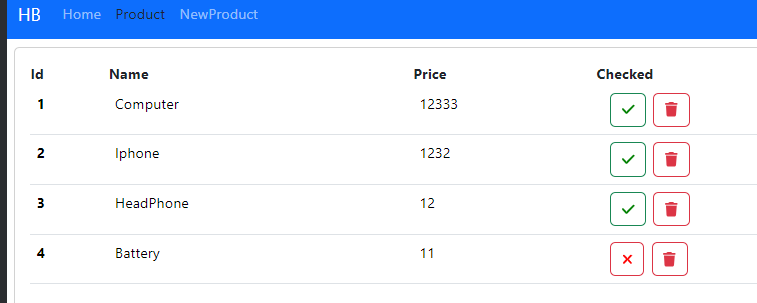

# ReactJS Framework 18 - Architecture - CRUD Example App -Axios-- Json-Server -Hooks
## Available Scripts

In the project directory, you can run:

    `npm start`

Runs the app in the development mode.\
Open [http://localhost:3000](http://localhost:3000) to view it in your browser.

## Creating Components Manually and Using CLI
### Manual Component Creation
#### To create React components manually, follow these steps:

1.Create a new file for your component, e.g., MyComponent.js.

2.Write your component using React syntax.

3.Import and use the component where needed.

#### Using CLI
To use the React CLI for component creation, run the following command:

    npx generate-react-cli component MyComponent

Replace my-app with your desired project name. This will set up a new React project with the necessary files and folder structure.

## Uses of React Hooks
### Use State
React useState hook is used for adding state to functional components. Example:

    import React, { useState } from 'react';
    
    function MyComponent() {
    const [count, setCount] = useState(0);
    
        return (
            

            
You clicked {count} times

            <button onClick={() => setCount(count + 1)}>
            Click me
            </button>
            

    );
    }

### Use Effect
React useEffect hook is used for side effects in functional components. Example:

    import React, { useEffect } from 'react';
    
    function MyComponent() {
        useEffect(() => {
        // Your code for side effects goes here
        console.log('Component did mount');
        return () => {
        // Your cleanup code goes here
        console.log('Component will unmount');
        };
        }, []); // empty dependency array means it runs once after initial render
        
        return (
        

        {/* Component content */}
        

    );
    }
## Font Icons in React
To use font icons in React, install the following packages:

    npm i --save @fortawesome/fontawesome-svg-core
    npm install --save @fortawesome/free-solid-svg-icons
    npm install --save @fortawesome/react-fontawesome

Then, you can use icons in your components like this:

    import { FontAwesomeIcon } from '@fortawesome/react-fontawesome';
    import { faCheck} from '@fortawesome/free-solid-svg-icons';
    
    function MyComponent() {
    return (
        

        <FontAwesomeIcon icon={faCheck} />
        

    );
    }

## Use Rest API with JSON Server
To use JSON Server for mocking a REST API, follow these steps:

Install JSON Server:

    npm install json-server
Create your schema in a file, e.g., db.json Like this one
{

    "products":[
        {
            "id":1,
            "name":"Computer",
            "price":12344,
            "checked":false
        }
        ,
        {
            "id":2,
            "name":"Iphone",
            "price":12344,
            "checked":false
        }
    ]}
Run the JSON Server:

    npx json-server ./data/db.json -p 9000

## Axios for API Requests
Install Axios for making HTTP requests:

    npm install axios

Then, you can use Axios in your components to fetch data from your API. Example:

    import axios from 'axios';
    
    function fetchData() {
        axios.get('https://api.example.com/data')
        .then(response => {
        // Handle data
        console.log(response.data);
        })
        .catch(error => {
        // Handle error
        console.error(error);
    });
    }
Feel free to customize the examples and instructions based on your project's specific requirements.

### Product Component

    import React, { useState } from 'react'
    import '../App.css';
    import { FontAwesomeIcon } from '@fortawesome/react-fontawesome';
    import {faCheck,faCircle,faTrash, faXmark} from "@fortawesome/free-solid-svg-icons";
    
    function Product() {
    
    const [products,setProducts]=useState([
    {id:1,name:"Computer",price:12333,checked:false},
    {id:2,name:"Iphone",price:1232,checked:false},
    {id:3,name:"HeadPhone",price:12,checked:true},
    {id:4,name:"Battery",price:11,checked:true}
    ])

    const handleCheckProduct=(product)=>{
    
    const newProducts=products.map(prd=>{

    if(prd.id===product.id){
      prd.checked =  !prd.checked;
    }
    return prd;
    })
    
    setProducts(newProducts)
    }

    const handleDeleteProduct=(product)=>{
    
          const newProducts=products.filter(p=>p.id!=product.id);
          setProducts(newProducts)
    }
    
    return (

    

      

      

     <table className='table'>
      <thead>
        <th scope="col">Id</th>
        <th scope="col">Name</th>
        <th scope="col">Price</th>
        <th scope="col">Checked</th>
      </thead>
      <tbody>

        {products.map(product=>(
                  <tr key={product.id}>
                  <th scope="row">{product.id}</th>
                  <td>{product.name}</td>
                  <td>{product.price}</td>
                  <td>
                  <button 
                  onClick={()=>handleCheckProduct(product)}
                  className={product.checked ? 'btn btn-outline-success mx-2 ' :'btn btn-outline-danger mx-2 '}
                  >
        
                  <FontAwesomeIcon
                            icon={product.checked ? faCheck :faXmark}
                            color={product.checked ? 'green' :'red'}
                          ></FontAwesomeIcon>

                  </button>
                    
                      <button className='btn btn-outline-danger'
                      
                      onClick={()=>handleDeleteProduct(product)}
                      
                      >
                        <FontAwesomeIcon icon={faTrash}></FontAwesomeIcon>
                      </button>
                    </td>
                </tr>

        ))}
  
      </tbody>
      </table>
      

    

      

    )
    }

    export default Product

As a result we get Something like that 

Developed By: BRAIMI HAMZA :)) 